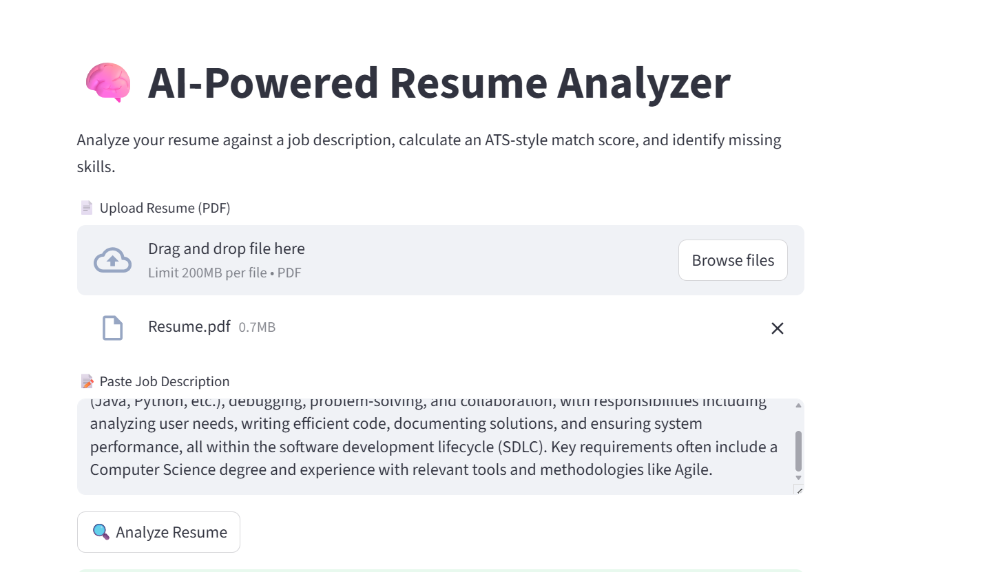
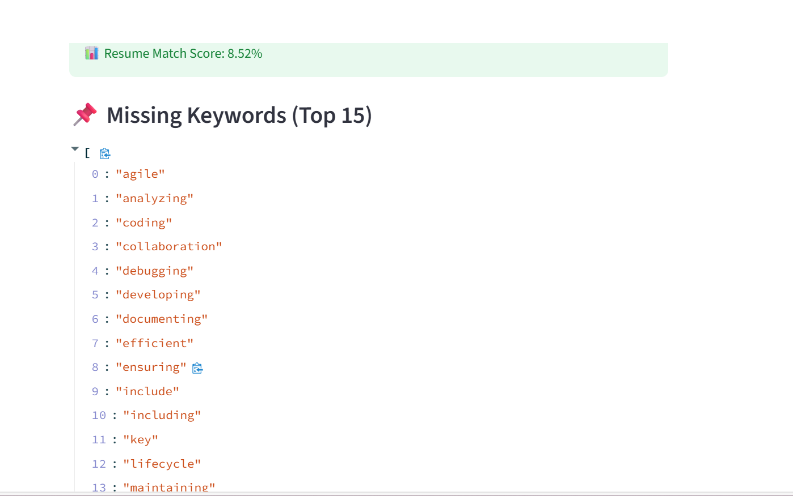

# 🧠 AI-Powered Resume Analyzer

This is a simple web application that helps students and job seekers understand
how well their resume matches a job description.

It provides a match score and highlights missing skills so you know what to
improve before applying.

---

## ✨ What this app does
- Upload your resume (PDF)
- Paste a job description
- Calculates a resume match score
- Shows missing keywords
- Displays skill gaps in a clear way

---

## 🛠 Tech used
- Python  
- Streamlit  
- NLP (TF-IDF)  
- scikit-learn  
- PyPDF2  

---

## ⚙️ How it works
1. The app extracts text from the resume PDF  
2. It compares the resume with the job description  
3. NLP is used to calculate similarity  
4. Missing skills and keywords are shown  

---

## 📸 Screenshots

### Home Page


### Resume Analysis Result


---

## ▶️ Run locally
```bash
git clone https://github.com/AafreenFathimaJ/resume-analyzer.git
cd resume-analyzer
pip install -r requirements.txt
python -m streamlit run app.py
